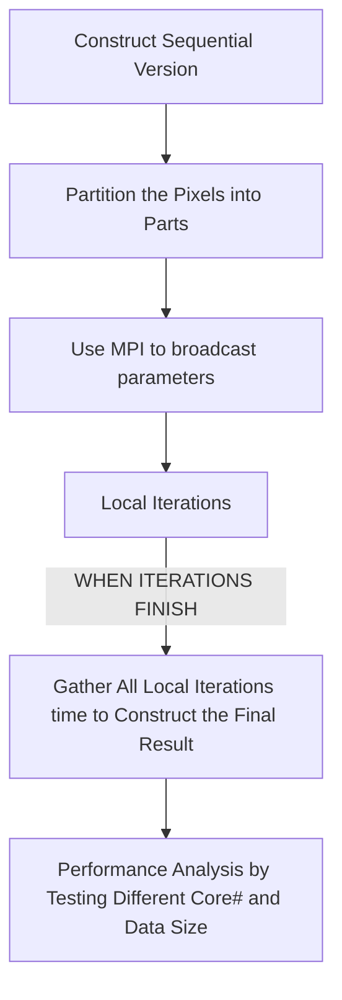
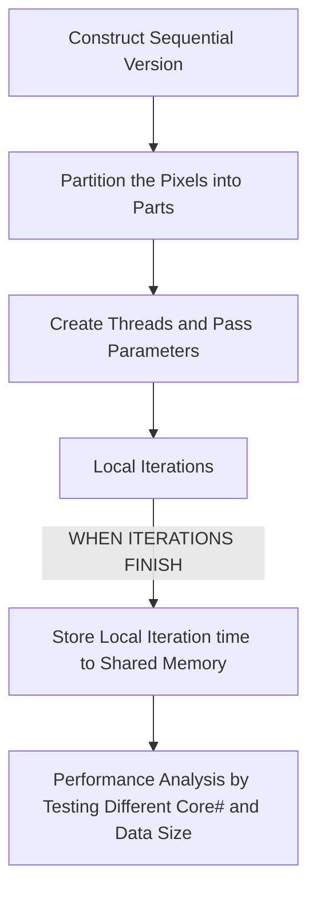
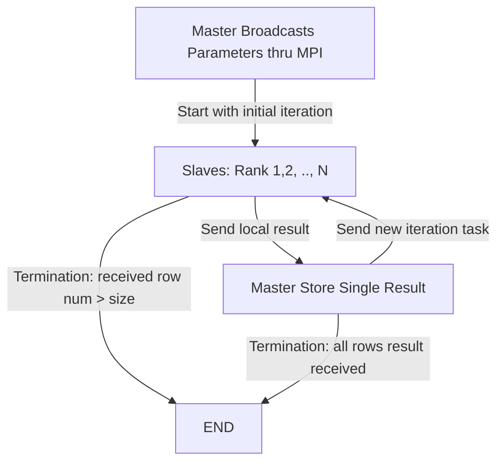
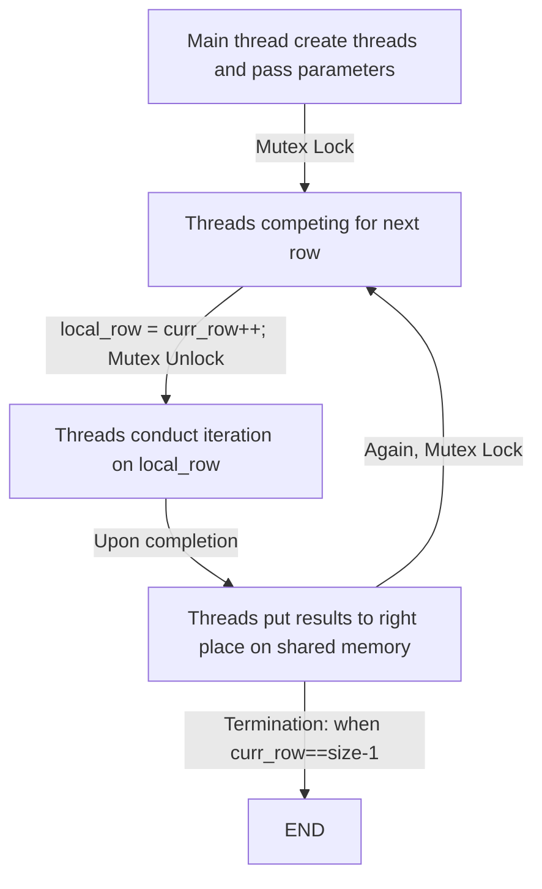

# CSC4005 - Project 3 **Report**
## Table of Contents
- [CSC4005 - Project 3 **Report**](#csc4005---project-3-report)
  - [Table of Contents](#table-of-contents)
  - [1. Introduction](#1-introduction)
    - [1.1 Project abstact](#11-project-abstact)
    - [1.2 N-body Simulation](#12-n-body-simulation)
      - [The sequential implementation](#the-sequential-implementation)
      - [The parallel implementations](#the-parallel-implementations)
    - [1.3 How to run](#13-how-to-run)
  - [2. Methods](#2-methods)
    - [2.1 Design process](#21-design-process)
    - [2.2 Data structure forming](#22-data-structure-forming)
    - [2.3 Job partitions and distributions](#23-job-partitions-and-distributions)
      - [MPI implementaitons](#mpi-implementaitons)
      - [Pthread implementation](#pthread-implementation)
      - [CUDA implementation](#cuda-implementation)
      - [OpenMP implementation](#openmp-implementation)
      - [Hybrid (OpenMP+MPI)](#hybrid-openmpmpi)
      - [MPI partition with dynamic scheduling](#mpi-partition-with-dynamic-scheduling)
      - [Pthread partition with dynamic scheduling](#pthread-partition-with-dynamic-scheduling)
    - [2.4 Local Simulation](#24-local-simulation)
    - [2.5 Rusults gathering](#25-rusults-gathering)
      - [MPI version](#mpi-version)
      - [Pthread version](#pthread-version)
    - [2.6 Performance analysis](#26-performance-analysis)
      - [Profiling preparation](#profiling-preparation)
      - [Testing on different number of cores](#testing-on-different-number-of-cores)
      - [Result analysis](#result-analysis)
  - [3. Results](#3-results)
    - [3.1 GUI Results](#31-gui-results)
      - [MPI Version](#mpi-version-1)
      - [Pthread Version](#pthread-version-1)
    - [3.2 Performance analysis](#32-performance-analysis)
      - [Speedup of parallelism](#speedup-of-parallelism)
      - [Horizontal Comparison](#horizontal-comparison)
        - [Pthread versus MPI](#pthread-versus-mpi)
        - [Dynamic scheduling versus Static scheduling](#dynamic-scheduling-versus-static-scheduling)
  - [4. Conslusion](#4-conslusion)
  - [5. Attachments](#5-attachments)

## 1. Introduction
### 1.1 Project abstact
In the project we are required to implement a parallel program simulating the N-body movements in a dimentinal plate, with CPU computation implemented in message passing manner via MPI, and in shared-memory manner with Pthread and OpenMP, hybrid manner via MPI combined with OpenMP and GPU computation implemented in Nvidia CUDA.

Compiler specificaitons:
* MPI, Pthread, OpenMP, Hybrid(bonus) implementations:
  ```
  clang version 12.0.1 
  (/llvm/llvm-project/clang fed41342a82f5a3a9201819a82bf7a48313e296b)
  Target: x86_64-unknown-linux-gnu
  Thread model: posix
  ```
* CUDA implementation:
  ```
  ## CUDA compiler:
  > Cuda compilation tools, release 11.4, V11.4.120
  > Build cuda_11.4.r11.4/compiler.30300941_0
  ## Host compiler:
  > g++ (GCC) 4.8.5 20150623 (Red Hat 4.8.5-28)
  ```

The program simulates N moving physcial bodies interacting with one another based on the Newton's law of universal gravitation in two-dimensional space.

The performance matrixing tests the MPI, Pthread, OpenMP and hybrid implementations on different core numbers ranging from 4 to 64 for the ease of comparison, with the number of bodies ranging from 100 to 800, and the iteration time is fixed to 600.
### 1.2 N-body Simulation
#### The sequential implementation
We can slice the continuous movement of the bodies into discrete time slice, and for the bodies in set ```B(t_1)```, its accleartion will based on the status in the previous time slice ```B(t_0)```, and there can be no dependency among elements in ```B(t_1)```.

Therefore, each time before I compute the acceleration, I will save a copy of the vector of ```bodies```, namely ```snapshot``` (i.e. the previous state), and change the attributes of each body (acceleration, velocity, position) independently in accordance with the content of ```snapshot```.

I contruct a class called Body encapsulating all attributes of a body and related method (which modifies the logic in the given template to make Body class independent). Therefore, the sequential version is a simple iteration:
```C++
std::vector<Body> snapshot = bodies;
for(size_t i = 0; i<bodies.size(); ++i) {
    # I. update accleration of bodies[i]
    # according to snapshot;
    # II. update velocity and position of
    # bodies[i] based on updated attributes.
}
```
Note there is NO DATA DEPENDENCY among different iterations of the for loop, making it very easy to be transformed into the parallel implementations.

#### The parallel implementations

The parallel implementations are highly similar to the sequential version stated above. Regardeless of the implementations, for each working slaves (processes, threads, etc.), they will all: 
* **Receive a full copy of ```snapshot```**
  Either in message passing manner in MPI or shard memory manner in Pthread and OpenMP, or memory copy from host to device in CUDA;

* **Copy the initial state of corresponding ```Body``` object from snapshot to there partition**, **update there partition**
  Do their own shares of the sequential loop above, according to the content in snapshot);

* **Send back their partition**
    Either in message passing manner in MPI or shard memory manner in Pthread and OpenMP, or memory copy from device to host in CUDA);

* All partitions combined consitutdes the bread new **bodies** vector which is the new state of bodies.

### 1.3 How to run
The ```CMakeLists.txt``` is sightly modifed to support two differents implementation, while the compiling process remains the same as the template:
```bash
cd /path/to/project
mkdir build && cd build
cmake ..
cmake --build .
```
In total 5 executables will be generated:
* ```nb_mpi```, ```nb_hybrid```: MPI and MPI + OpenMP (bonus) implementations of the program. 

  Arguments: 
  * ```-g```: enable GUI (default **disabled**)
  * ```-b some_value```: specify the number of the bodies (default 200)
  * ```-i some_value```: specify iteration times k (default 600)
  * ```-e some_value```: value of elapse (default 0.001)


* ```nb_pthread```, ```nb_omp```: Pthread and OpenMP implementations of the program. 

  Arguments: 
  * ```-g```: enable GUI (default **disabled**)
  * ```-t some_value```: specify the **thread number** (default 4)
  * ```-b some_value```: specify the number of the bodies (default 200)
  * ```-i some_value```: specify iteration times k (default 600)
  * ```-e some_value```: value of elapse (default 0.001)


* ```nb_cuda```: CUDA implementation of the program. 

  Arguments: 
  * ```-g```: enable GUI (default **disabled**)
  * ```-x some_value```: specify the **grid dimension** (default 4)
  * ```-y some_value```: specify the **block dimension** (default 4)
  *i.e. the default config will utilized 16 threads accross 4 blocks*
  * ```-b some_value```: specify the number of the bodies (default 200)
  * ```-i some_value```: specify iteration times k (default 600)
  * ```-e some_value```: value of elapse (default 0.001)

Note that the value of these parameters can also be dynamically adjusted in GUI interface if GUI is enabled (by feeding -g argument).
  
An example to run the MPI version in parallel (hybrid is similar):
```bash
cd /path/to/project/build
# non-gui run:
mpirun ./nb_mpi
# gui run:
mpirun ./nb_mpi -g
```
  
An example to run the Pthread version in parallel (OpenMP is similar):
```bash
cd /path/to/project/build
# non-gui run with 8 threads
./nb_pthread -t 8
# gui run with 8 threads
./nb_pthread -g -t 8
```

An example to run CUDA (OpenMP is similar):
```bash
cd /path/to/project/build
# non-gui run with 4x8 block v thread
srun ./nb_cuda -x 4 -y 8
# gui run with default 4x4 block v thread
./nb_cuda -g
```


## 2. Methods
### 2.1 Design process
The design process is consists of implementation and optimization. In terms of implementation, there are in total 5 steps, which are **constructing sequential version**, **partitioning pixels**, **delivering parameters**, **implementing local iterations** finally **collecting local results** to formulate the final result.

An illustration of the staic scheduling approach is showned as below:

<table style="width: 100%; border-collapse: collapse;" >
<tbody style ="border: none;">
<tr style ="border: none;">
<td style ="border: none;">
<figure align="center" style="width: 90%;">


<figcaption>Figure 1: MPI Staic Scheduling</figcaption>
</figure>
</td>
<td style ="border: none;">
<figure align="center"  style="width: 90%;">


<figcaption>Figure 2: Pthread Staic Scheduling</figcaption>
</figure>
</td>
</tr>
</tbody>
</table>

As for the dynamic scheduling approach, the design process become a little bit more complicated, which is illustrated below:

<figure align="center"  style="width: 100%;">


<figcaption>Figure 3: MPI Dynamic Scheduling</figcaption>
</figure>

<figure align="center"  style="width: 100%;">


<figcaption>Figure 4: Pthread Dynamic Scheduling</figcaption>
</figure>

Multiple tests are conducted on different core numbers in **[1, 2, 4, 8, 16, 24, 32]** using **i) MPI Static Scheduling**, **ii) Pthread Static Scheduling**, **iii) MPI_Dynamic Scheduling**, **iv) Pthread_Dynamic Scheduling** with image sizes in **[400, 800, 1600, 2400, 3200, 4800, 6400]** repectively for performance analysis and comparison purposes.

### 2.2 Data structure forming

### 2.3 Job partitions and distributions
To start contructing the parallel version of the algorithm, we must first partition the job into chunks of tasks and distributes them to each working nodes. Implementations of partitioning and distributing are explored.

#### MPI implementaitons

Stiatic scheduling means a fixed/compile-time partitioning scheme. Therefore, instead of having master process to notify slave processes of the partition, the slave processes can calculate their own share in parallel based on the fixed scheme, thereby increasing the level of parallism and reducing the communication as well.

Although we have no control on the iteration workload of each row in static scheduling, we still want the **number** of rows distributed to the slaves as even as possible, so a partition scheme is derived with the idea of ```⌈(M-i)/n⌉``` (M being number of rows, i being rank, n being processes number) from discrete mathematics:

```C++
inline int getLength(const int &size, const int &proc, const int &rank){
    //porc-1, rank-1 to exclude master
    if(size<(proc-1)) return (rank-1)<size;
    return (size-rank+1)/proc + ((size-rank+1)%proc > 0); // ceil funct
}
```
With such helper function, each slave process can derive how many rows it need to process and the starting row for its share as well. Note that Pthread version works in the same way, except that it has no information of rank/thread-id which needs passing manually as arguments to the thread routine.


#### Pthread implementation

#### CUDA implementation
#### OpenMP implementation
#### Hybrid (OpenMP+MPI)
#### MPI partition with dynamic scheduling
In my implementation, the slaves can first work on the initial row **(row#=rank#)** without any message from the master, then the moment it finishes with the initial work and send back the results to the master process, the master process will distribute next row that needs computing to it, and keeps repeating so on so forth. So the partitioning basically works based on the row number (an integer) master sends to the slave.

To achieve such way of dynamic scheduling/ partitioning, the master process needs to keep listening for any message from the slaves to process the results and distribute new task (row). This is done by the blocking probe function of ```MPI_Probe()``` inside a while loop:
```C++
while(recv_row<size-1){
  MPI_Probe(MPI_ANY_SOURCE, MPI_ANY_TAG, MPI_COMM_WORLD, &status);
  recv_row++;
  ...
}
```

In such partition shceme, slave processes that completes faster can get more rows to compute, so as to achieve better load balancing given that the iteration times are inbalanced accross the rows (rows with quasi-stable points densely distributed will certainly takes longer to process).

#### Pthread partition with dynamic scheduling
Pthread dynamic scheduling share the same mindset of the MPI dynamic scheduling parition method, however, the partition is **not** done by the master (main) thread, but by competition among the slave threads by leveraging the mutex lock:
```C++
pthread_mutex_lock(&mutex);
while(curr_row<size-1){
  my_row = curr_row++;
  pthread_mutex_unlock(&mutex);
  ...
  pthread_mutex_lock(&mutex);
}
pthread_mutex_unlock(&mutex);
```


### 2.4 Local Simulation
### 2.5 Rusults gathering

#### MPI version
When static scheduling approach is adopted, the results gathering is done by calling ```MPI_Gatherv``` function to gather all the final results, and also plays a role for synchronization upon the finish of partitioned jobs.

On the other hand, when dynamic scheduling approach is instead adopted, the results gathering, by its nature, is done by master process repetitvely receiving the results row by row from the slaves. The results slaves send to master is compacted in a structure called ```Row```, to compact the row number and row results together:
```C++
struct Row {
    int index;
    int content[1]; //a flexible array member
};
```

#### Pthread version
The shared-memory nature of multi-threading makes it trivial to gather the results, regardless of the scheduling methods. The local results are directly stored to the final buffer array.


### 2.6 Performance analysis
The performance anaylysis is conducted in follow steps:
#### Profiling preparation
In the program, the C++ class ```std::chrono::high_resolution_clock``` is used to count the **total running time**, which will be **printed upon completion of the program**.


#### Testing on different number of cores
With two implementations (MPI and Pthread) compiled and ready to run, multiple ```bash``` scripts are generated to run the 2 programs with different parameters and on different number of cores, an exmaple (```/pvfsmnt/119010486/script_2/t32_s6400.sh```) of the script running MPI version on ```32 cores``` and ```image size 6400``` is as follows:
```shell
#!/bin/bash
#SBATCH --account=csc4005
#SBATCH --partition=debug
#SBATCH --qos=normal
#SBATCH --ntasks=32
#SBATCH --nodes=1
mpirun /pvfsmnt/119010486/proj2/nb_mpi -s 6400 >> \
/pvfsmnt/119010486/proj2/test_results/mpi/32_6400_static.res
mpirun /pvfsmnt/119010486/proj2/nb_mpi -d -s 6400 >> \
/pvfsmnt/119010486/proj2/test_results/mpi/32_6400_dynamic.res
```

Another exmaple (```/pvfsmnt/119010486/script_2p/t32_s6400.sh```) of the script running Pthread version with ```32 threads``` and ```image size 6400``` is as follows:
```shell
#!/bin/bash
#SBATCH --account=csc4005
#SBATCH --partition=debug
#SBATCH --qos=normal
#SBATCH --ntasks=32
#SBATCH --nodes=1
/pvfsmnt/119010486/proj2/nb_pthread -s 6400 -t 32 >> \
/pvfsmnt/119010486/proj2/test_results/pthread/32_6400_static.res
/pvfsmnt/119010486/proj2/nb_pthread -d -s 6400 -t 32 >> \
/pvfsmnt/119010486/proj2/test_results/pthread/32_6400_dynamic.res
```
Finally, it is submitted also with a script (```/pvfsmnt/119010486/script_2/submit.sh```):
```shell
#!/bin/bash
sbatch /pvfsmnt/119010486/script_2/t1_s400.sh
sleep 12
sbatch /pvfsmnt/119010486/script_2/t1_s800.sh
sleep 25
...
```
Simply put, the outcome of these packs of scripts will be results matrix in two dimension **image size** and **core number**. Inside each set, there are results from running **i) MPI Static Scheduling**, **ii) Pthread Static Scheduling**, **iii) MPI_Dynamic Scheduling**, **iv) Pthread_Dynamic Scheduling** respectively for comparison purposes. Inside each result file, there are **total running time** and **speed per pixel**. The whole set of result files are then compressed and downloaded to the local computer.

Multiple tests are conducted on different core numbers in **[1, 2, 4, 8, 16, 24, 32]** using **i) MPI Static Scheduling**, **ii) Pthread Static Scheduling**, **iii) MPI_Dynamic Scheduling**, **iv) Pthread_Dynamic Scheduling** with image sizes in **[400, 800, 1600, 2400, 3200, 4800, 6400]** repectively for performance analysis and comparison purposes.
#### Result analysis
The result files are parsed using ```Python```. ```Pandas``` library is leveraged to organize the performance factors into tables with **Image Sizes** being the column and **Core Number** being the row. Serveral graph is plotted as well to visualize the result. The outcome of the optimization is also inspected through test results.


## 3. Results
### 3.1 GUI Results
#### MPI Version
**Testing on 8 core configuration, dynamic scheduling**

Running arguments: 
```shell
mpirun -np 8 ./nb_mpi -gds 800 -y -210
# this is run on local machine
# mpirun-gui shall be used when testing on cluster
```
Running screenshot: 


#### Pthread Version
**Testing on 8 core configuration, dynamic scheduling**

Running arguments: 
```shell
./nb_pthread -gds 800 -y -210 -t 8
```
Running screenshot: 


### 3.2 Performance analysis
#### Speedup of parallelism

The speedup of parallelism is calculated by the running time divided by the running time on single core/thread for each correponding image size. The running time of dynamic scheduling is used to analyze the speedup here because it exploits parallelism better.

We can observe that the image size does not have a great influence on the speedup, and the MPI speedup is about 70%~80% of the ideal (linear) speedup, whereas the Pthread speedup is about 87%~90% of the ideal (linear speedup). In other words, the parallel effciency of the MPI program is around 70%~80% and that of the pthread program is around 90%.

Shown below are the illustrations of the MPI and Pthread speedup, with x axis being image size, y axis being speedup, **and the case where ```core#=1``` constitudes the sequential version**:
<figure align="center">


<figcaption>Figure 7: Overall Speedup Attributes of MPI (Dynamic)</figcaption>
</figure>


<figure align="center">


<figcaption>Figure 8: Overall Speedup Attributes of Ptrhead (Dynamic)</figcaption>
</figure>


More horizontal comparisons and analysis are to carried out on **Pthread versus MPI** and **Dynamic Scheduling versus Static Scheduling**.

#### Horizontal Comparison

##### Pthread versus MPI
By observation, the speedup of the Pthread version outperforms the MPI version by from 10% to up to 40%, and the gap grows increasingly bigger as the number of cores/threads goes larger, which is illustrated in the graph below:

  <figure align="center">


  <figcaption>Figure 9: MPI Speedup versus Pthread Speedup (Dynamic)</figcaption>
  </figure>

The potential reason behind the gap of MPI version and Pthread version may lies in the effciency gap between memory access and message passing. As the threads in the pthread version has uniform, shared access to the memory and has no need to pass message, the communication time for message passing could be saved. Such interpretation is consistent with the fact that the gap grows as number of cores grows, because the more the cores (processes), the more message passing and communication are involved in the MPI program, thereby enlarging the gap.
##### Dynamic scheduling versus Static scheduling

A even larger gap is observed when comparing the speedup of dynamic scheduling version and static scheduling version. In the MPI case, the dynamic scheduling method almost outperforms in all cases except when core number is as small as two, which may because the more uniform workload distribution dynamic scheduling brings does not contribute a lot when the core number is only 2, and the overhead it brings to send message back and forth overweights the positive contribution.

However, in most cases the dynamic scheduling methods far outperforms the static scheduling methods.

  <figure align="center">


  <figcaption>Figure 10: Dynamic Scheduling versus Static Scheduling (MPI)</figcaption>
  </figure>

The the case of Pthread program, the dynamic scheduling method performs better all the time, possibly because the overhead of dynamic scheduling in pthread program is negligible because scheduling is done by lock competition but not the master:

  <figure align="center">


  <figcaption>Figure 11: Dynamic Scheduling versus Static Scheduling (Pthread)</figcaption>
  </figure>

To further explore the benifits of dynamic sheduling, the running time of slave threads are profiled both in dynamic case and static case:
* Static scheduling, 8 threads, size = 6400:
  ```shell
  bash-4.2$ ./nb_pthread -s 6400 -t 8
  TID #0 takes 739578913 ns.
  TID #6 takes 1087624968 ns.
  TID #1 takes 1187957269 ns.
  TID #7 takes 1256036975 ns.
  TID #5 takes 4739958006 ns.
  TID #2 takes 4962058261 ns.
  TID #3 takes 13131878920 ns.
  TID #4 takes 14382012542 ns.
  40960000 pixels in last 14392932715 nanoseconds
  ```
  The standard deviation of running time above is ```σ = 5,195,539,375```, which is significantly large. We can see the running time of thread #4 is around 20 times of that of thread #5, manifesting the significant workload imbalance of Mandelbrot Set computation when the static scheduling method is adopted. Then the dynamic case is experimented to examine its improvements on load balancing.
* Dynamic scheduling, 8 threads, size = 6400:
  ```shell
  bash-4.2$ ./nb_pthread -ds 6400 -t 8
  TID #5 takes 7670693942 ns.
  TID #0 takes 7685463734 ns.
  TID #7 takes 7686035852 ns.
  TID #3 takes 7672883296 ns.
  TID #1 takes 7690896230 ns.
  TID #2 takes 7677369528 ns.
  TID #4 takes 7677369559 ns.
  TID #6 takes 7675372096 ns.
  40960000 pixels in last 7691264254 nanoseconds
  ```
  Now the standard deviation is reduced 1,000 times to ```σ = 6,667,096```. The longest running time (TID #1) is only 0.26% more than the shortest one (TID #6), introduing great improvements to load balancing. 

## 4. Conslusion
In the project a parallel Mandelbrot Set computation algorithm is implemented and anaylzed. Two version in MPI and Pthread are implemented. For each version, implementations in both static scheduling approach and dynamic scheduling approach are done for comparison purposes.

In total 196 ```(7-sizes * 7-core-configurations * 4-implementations) ```tests are carried out, each implementation testing its performance over 7 different core number from 1 to 32 over the image size ranging from 400 to 6400. The speed up is examined on the matrix of core numbers and data sizes. The running time/duration is examined. The test is conducted through a series of script files generated with Python.

The result is parsed and visualized by leveraging the Python Pandas library. The speedup is almost independent to the image size in the range of experiment. Ideal speedup (around 90% parallel effiency, close to linear speedup) is observed in the pthread dynamic scheduling version, followed by the MPI dynamic shceduling version, getting a 70%~80% parallel effiency (compared to the linear speedup). The Pthread version outperforms probably because the communication overhead is smaller thanks to the shared-memory nature of pthread. From such observation we may come to a conclusion that Pthread may be preferred over MPI when the parallelism does not span across nodes (i.e. lies within a single node/machine).

On top of that, the speedup of the static scheduling versions significantly lag behinds their dynamic counterparts mentioned above. This may be atrributed to the extreme imbalance of workload among rows of the Mandelbrot Set computation we observe by experiment, in which case dynamic scheduling greatly improves the load balancing capability. Despite the communication overhead it may introduce especially in the MPI version, the benifits far overwhelms the costs. 

## 5. Attachments
* ```attachments/results.xlsx```: The data behind the plotted graph, with 8 sheets in the file.
* ```attachments/raw_res.tar```: The raw output files from which the above result is retrieved.