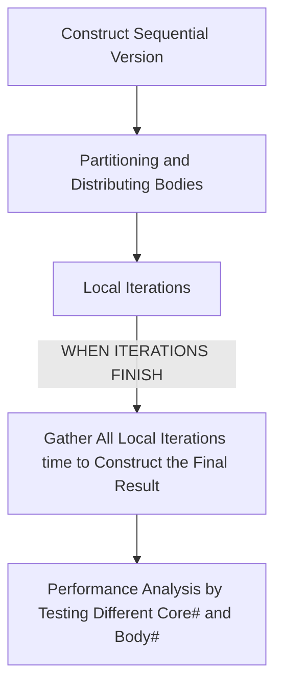

# Parallel Computing: N-body Simulation
## Table of Contents
- [Table of Contents](#table-of-contents)
- [1. Introduction](#1-introduction)
  - [1.1 Project abstact](#11-project-abstact)
  - [1.2 N-body Simulation](#12-n-body-simulation)
    - [The sequential implementation](#the-sequential-implementation)
    - [The parallel implementations](#the-parallel-implementations)
  - [1.3 How to run](#13-how-to-run)
- [2. Methods](#2-methods)
  - [2.1 Design process](#21-design-process)
  - [2.2 Data structure forming](#22-data-structure-forming)
  - [2.3 Sequantial Implementation](#23-sequantial-implementation)
  - [2.3 Job partitions and distributions](#23-job-partitions-and-distributions)
    - [MPI implementaitons](#mpi-implementaitons)
    - [Pthread implementation](#pthread-implementation)
    - [CUDA implementation](#cuda-implementation)
    - [OpenMP implementation](#openmp-implementation)
    - [Hybrid (OpenMP+MPI)](#hybrid-openmpmpi)
  - [2.4 Local Calculation](#24-local-calculation)
  - [2.5 Rusults gathering](#25-rusults-gathering)
    - [MPI implementaitons](#mpi-implementaitons-1)
    - [Pthread implementation](#pthread-implementation-1)
    - [CUDA implementation](#cuda-implementation-1)
    - [OpenMP implementation](#openmp-implementation-1)
    - [Hybrid (OpenMP+MPI)](#hybrid-openmpmpi-1)
  - [2.6 Performance analysis](#26-performance-analysis)
    - [Profiling preparation](#profiling-preparation)
    - [Testing on different number of cores/threads/node](#testing-on-different-number-of-coresthreadsnode)
      - [MPI-like](#mpi-like)
      - [Pthread-like](#pthread-like)
      - [CUDA](#cuda)
    - [Result analysis](#result-analysis)
- [3. Results](#3-results)
  - [3.1 GUI Results](#31-gui-results)
  - [3.2 Performance analysis](#32-performance-analysis)
    - [All but CUDA](#all-but-cuda)
    - [CUDA Analysis](#cuda-analysis)
- [4. Conslusion](#4-conslusion)
- [5. Attachments](#5-attachments)

## 1. Introduction
### 1.1 Project abstact
In the project we are required to implement a parallel program simulating the N-body movements in a dimentinal plate, with CPU computation implemented in message passing manner via MPI, and in shared-memory manner with Pthread and OpenMP, hybrid manner via MPI combined with OpenMP and GPU computation implemented in Nvidia CUDA.

Compiler specificaitons:
* MPI, Pthread, OpenMP, Hybrid(bonus) implementations:
  ```
  clang version 12.0.1 
  (/llvm/llvm-project/clang fed41342a82f5a3a9201819a82bf7a48313e296b)
  Target: x86_64-unknown-linux-gnu
  Thread model: posix
  ```
* CUDA implementation:
  ```
  ## CUDA compiler:
  > Cuda compilation tools, release 11.4, V11.4.120
  > Build cuda_11.4.r11.4/compiler.30300941_0
  ## Host compiler:
  > g++ (GCC) 4.8.5 20150623 (Red Hat 4.8.5-28)
  ```

The program simulates N moving physcial bodies interacting with one another based on the Newton's law of universal gravitation in two-dimensional space.

The performance matrixing tests the MPI, Pthread, OpenMP and hybrid implementations on different core numbers ranging from 4 to 64 for the ease of comparison, with the number of bodies ranging from 100 to 800, and the iteration time is fixed to 600.
### 1.2 N-body Simulation
#### The sequential implementation
We can slice the continuous movement of the bodies into discrete time slice, and for the bodies in set ```B(t_1)```, its accleartion will based on the status in the previous time slice ```B(t_0)```, and there can be no dependency among elements in ```B(t_1)```.

Therefore, each time before I compute the acceleration, I will save a copy of the vector of ```bodies```, namely ```snapshot``` (i.e. the previous state), and change the attributes of each body (acceleration, velocity, position) independently in accordance with the content of ```snapshot```.

I contruct a class called Body encapsulating all attributes of a body and related method (which modifies the logic in the given template to make Body class independent). Therefore, the sequential version is a simple iteration:
```C++
std::vector<Body> snapshot = bodies;
for(size_t i = 0; i<bodies.size(); ++i) {
    # I. update accleration of bodies[i]
    # according to snapshot;
    # II. update velocity and position of
    # bodies[i] based on updated attributes.
}
```
Note there is NO DATA DEPENDENCY among different iterations of the for loop, making it very easy to be transformed into the parallel implementations.

#### The parallel implementations

The parallel implementations are highly similar to the sequential version stated above. Regardeless of the implementations, for each working slaves (processes, threads, etc.), they will all: 
* **Receive a full copy of ```snapshot```**
  Either in message passing manner in MPI or shard memory manner in Pthread and OpenMP, or memory copy from host to device in CUDA;

* **Copy the initial state of corresponding ```Body``` object from snapshot to there partition**, **update there partition**
  Do their own shares of the sequential loop above, according to the content in snapshot);

* **Send back their partition**
    Either in message passing manner in MPI or shard memory manner in Pthread and OpenMP, or memory copy from device to host in CUDA);

* All partitions combined consitutdes the bread new **bodies** vector which is the new state of bodies.

### 1.3 How to run
The ```CMakeLists.txt``` is sightly modifed to support two differents implementation, while the compiling process remains the same as the template:
```bash
cd /path/to/project
mkdir build && cd build
cmake ..
cmake --build .
```
In total 5 executables will be generated:
* ```nb_mpi```, ```nb_hybrid```: MPI and MPI + OpenMP (bonus) implementations of the program. 

  Arguments: 
  * ```-g```: enable GUI (default **disabled**)
  * ```-b some_value```: specify the number of the bodies (default 200)
  * ```-i some_value```: specify iteration times k (default 600)
  * ```-e some_value```: value of elapse (default 0.001)


* ```nb_pthread```, ```nb_omp```: Pthread and OpenMP implementations of the program. 

  Arguments: 
  * ```-g```: enable GUI (default **disabled**)
  * ```-t some_value```: specify the **thread number** (default 16)
  * ```-b some_value```: specify the number of the bodies (default 200)
  * ```-i some_value```: specify iteration times k (default 600)
  * ```-e some_value```: value of elapse (default 0.001)


* ```nb_cuda```: CUDA implementation of the program. 

  Arguments: 
  * ```-g```: enable GUI (default **disabled**)
  * ```-x some_value```: specify the **grid dimension** (default 2)
  * ```-y some_value```: specify the **block dimension** (default 64)
  *i.e. the default config will utilized 128 threads accross 2 blocks*
  * ```-b some_value```: specify the number of the bodies (default 200)
  * ```-i some_value```: specify iteration times k (default 600)
  * ```-e some_value```: value of elapse (default 0.001)

Note that the value of these parameters can also be dynamically adjusted in GUI interface if GUI is enabled (by feeding -g argument).
  
An example to run the MPI version in parallel (hybrid is similar):
```bash
cd /path/to/project/build
# non-gui run:
mpirun ./nb_mpi
# gui run:
mpirun ./nb_mpi -g
```
  
An example to run the Pthread version in parallel (OpenMP is similar):
```bash
cd /path/to/project/build
# non-gui run with 8 threads
./nb_pthread -t 8
# gui run with 8 threads
./nb_pthread -g -t 8
```

An example to run CUDA (OpenMP is similar):
```bash
cd /path/to/project/build
# non-gui run with 1x128 block v thread
srun ./nb_cuda -x 1 -y 128
# gui run with default 2x64 block v thread
./nb_cuda -g
```


## 2. Methods
### 2.1 Design process
The design process is consists of in total 5 steps, which are **constructing sequential version**, **partitioning bodies object**, **distributing partitions**, **implementing local calculations** finally **collecting local results** to formulate the final result.

An illustration of the staic scheduling approach is showned as below:

<figure align="center"  style="width: 100%;">


<figcaption>Figure 1: Overall Design Process</figcaption>
</figure>

Note that this is a uniform design idea suitable for all the implementations, with minor changes only.


Multiple tests are conducted on different core/thread numbers in **[1,4,8,16,32,64]** using:
*  **i) MPI**
  1,4,8,16,32,64 tasks with 1 core per task spanning from 1 to 2 nodes;
*  **ii) Pthread**:
 1,4,8,16,32,64 threads with maximum 32 core only on a single node, including case of over-spawning;
* **iii) OpenMP**:
   1,4,8,16,32,64 threads with maximum 32 core only on a single node, including case of over-spawning;
* **iv) CUDA**:
grid dimension and block dimension selected in [(1,32),(1,64),(1,128),(1,256),(2,128),(4,64)]) 
* **v) Hybrid**:
    1,4,8,16,32,64 tasks with 1 core per task spanning from 1 to 2 nodes, but using OpenMP on the same node, and MPI across the nodes.

with body number in **[100,500,1000]** repectively for performance analysis and comparison purposes.

### 2.2 Data structure forming
All atttributes and methods related to a body is encapsulated into a ```Body``` class and all body objects are stored in a vector. Therefore it is neater to partition body object, as a whole (as opposed to seperate attributes of the bodies), to the working slaves and collect them back.

### 2.3 Sequantial Implementation
We can slice the continuous movement of the bodies into discrete time slice, and for the bodies in set ```B(t_1)```, its accleartion will based on the status in the previous time slice ```B(t_0)```, and there can be no dependency among elements in ```B(t_1)```.

Therefore, each time before I compute the acceleration, I will save a copy of the vector of ```bodies```, namely ```snapshot``` (i.e. the previous state), and change the attributes of each body (acceleration, velocity, position) independently in accordance with the content of ```snapshot```.

Therefore, the sequential version is a simple iteration:
```C++
std::vector<Body> snapshot = bodies;
for(size_t i = 0; i<bodies.size(); ++i) {
    # I. update accleration of bodies[i]
    # according to snapshot;
    # II. update velocity and position of
    # bodies[i] based on updated attributes.
}
```
In the detailed implmentation of "update accleration of bodies[i] according to snapshot", **a minimum distance**, which is twice the radius is set to deal with the inifinite acceleration in case of collision, and when the body collide with the boundary of space (walls), it will bounce back changing the direction of velocity.
### 2.3 Job partitions and distributions
To start contructing the parallel version of the algorithm, we must first partition the job into chunks of tasks and distributes them to each working nodes. Implementations of partitioning and distributions are explored.

#### MPI implementaitons

To partition the Ball objects into serveral working processes as banlance as possible a partition scheme is derived with the idea of ```⌈(M-i)/n⌉``` (M being number of rows, i being rank, n being processes number) from discrete mathematics:

```C++
inline int getLength(const int &size, const int &proc, const int &rank){
    //porc-1, rank-1 to exclude master
    if(size<proc) return rank<size;
    return (size-rank)/proc + ((size-rank)%proc > 0); // ceil funct
}
```
Note that each working processes needs the **full** snapshot consisting states of **all** bodies in the previous timestamp, so ```MPI_BCast``` is used to distribute the snapshot vector to everyone.
From the working processes point of view, the snapshot can play two role in the same time:
* As the initial value of its partition
For example, rank 1 is responsible for body 1,2,3,4, then it can initialize its partition with snapshot[1],snapshot[2],snapshot[3],snapshot[4].

* As a reference of the previous state to calculate new accelerations

Also, an struct object compacting all needed parameters (gravity, space, etc.) is broadcast as well. Then the working processes have got enough information to go.

#### Pthread implementation
The schema of partitioning is **extactly the same** as the MPI implementation, but in the manner of share memory. Each time of calculation, the bodies vector is duplicated (to create a snapshot), and pointers of bodies vector and snapshot vector are passed to each thread.
Each thread only **reads from** the snapshot, which threads can read the whole vector without data races and inconsistency as no wirte is involved, and it **writes to** the bodies, but **only their own share**, meaning that there is **no overlap** among the writing, therefore avoiding any data races as well. This is better than the lock based implementation which greatly decreses the level of paralllism.
#### CUDA implementation
In CUDA implementations, an alternative method of partitioning is used, which is basically the simple framework as follows:
```C++
int index = blockIdx.x * blockDim.x + threadIdx.x;
int stride = blockDim.x * gridDim.x;
for(int i=index;i<bodies_num; i+=stride){
    //do own share of work
}
```
Such simple paritioning (cycle-wise instead of block-wise) can be adapted to any block and grid dimension configuration, and providing a ralatively balanced partition as well.
As for the distribution, it is rather simple: the bodies vector (precisely should be the underlying data because cuda does not support ```std::vector```) is copied twice to the device (once as snapshot, once as bodies to be update):
```C++
cudaMemcpy(device_bodies, bodies, size*sizeof(Body),
cudaMemcpyHostToDevice);
cudaMemcpy(device_snapshot, bodies, size*sizeof(Body),
cudaMemcpyHostToDevice);
slave_cal<<<g_dim,block_dim>>>(device_bodies,
device_snapshot,size,elapse,gravity,position_range,radius);
```
#### OpenMP implementation
The partition and distribution of the bodies in OpenMP is done implicitly by the compiler with only simple pragma involved:
```C++
#pragma omp parallel for shared(..) default(none)
```
#### Hybrid (OpenMP+MPI)
In the hybrid approach, the partitioning among the MPI processes is consistent with the [MPI implementaitons](#mpi-implementaitons), while in each MPI process, the OpenMP approach is adopted (by adding the above pragma to the local for loop).


### 2.4 Local Calculation
The local calulculation is rather simple with the model of "snapshot", which is almays the same as the sequantial verison.
### 2.5 Rusults gathering

#### MPI implementaitons

In MPI implementation, each working process will create a vector called **my_partition**, initialized according to the corresponding value in vector ```snapshot```(received in partioning part). After conducting computation and simulation, the result (new status of its share of bodies) will be stored into the **my_partition** vector.
To collect the results, the ```MPI_Gatherv``` is called to send back (from working processes POV) and collect (from master process POV) the results:
```
MPI_Gatherv(my_partition.data(),...);
```
Note that in all MPI message passing, ```MPI_Byte``` type is used as a hack to send and receive different types of objects, assuming that the nodes are homogenous in terms of endiness.
#### Pthread implementation
The shared memory nature make it easy to collect results. As is mentioned in the paritioning part, pointers to snapshot vector (read only) and bodies vector are passed to the threads, the threads can simply write the result to the bodies vector without overlapping, and therefore no data races.

#### CUDA implementation
In CUDA implementations, the memory allocated by is shared (among threads and blocks) as well (by ```CudaMalloc```). Therefore, we only need to copy bodies data from device back to host.

However, the kernel function call will not block the CPU. Therefore, for the sake of syncronization, ```cudaDeviceSynchronize()``` is called before memcpy:
```C++
cudaDeviceSynchronize();
cudaMemcpy(bodies, device_bodies,size*sizeof(Body),
cudaMemcpyDeviceToHost);
```

#### OpenMP implementation
The collection of the bodies in OpenMP is done implicitly by the compiler as well.

#### Hybrid (OpenMP+MPI)
Basically the same as [MPI implementaitons](#mpi-implementaitons-1), except that the OpenMP pragma is used for the ```for``` loop in each working process.


### 2.6 Performance analysis
The performance anaylysis is conducted in follow steps:
#### Profiling preparation
In the program, the C++ class ```std::chrono::high_resolution_clock``` is used to count the **total running time**, which will be **printed upon completion of the program**.


#### Testing on different number of cores/threads/node

The implementations are divided into three groups:
* **MPI-like**: MPI, Hybrid
* **Pthread-like**: Pthread, OpenMP
* **CUDA**

##### MPI-like
**MPI**: test are conducted with different number of tasks selected in **[1,4,8,16,32,64]**, each task comes with **a single** allocated CPU core, and for the 64 tasks config, two nodes are used.
**Hybrid**: test are conducted with different number of **cores** selected in **[1,4,8,16,32,64]**, each task comes with at most **16** allocted CPU core (so the corresponding task number is **[1,1,1,1,2,4]**), and for the 64 tasks config, two nodes are used.
For example:
For 8 cores config: task#=1; cpus-per-task=8;
For 16 cores config: task#=1; cpus-per-task=16;
For 32 cores config: task#=2; cpus-per-task=16;


##### Pthread-like
Both OpenMP and Pthread implementations will be tested with different number of threads (by feading argument to the program). The task number (i.e. CPU core number as the default cpus-per-task is 1) will be: ```min(thread_num,32)``` and all on a single node. Therefore the case of 64 threads is to experiment the effect of **over-spawning**.

##### CUDA
CUDA is different form the CPU computations above, therefore totally different config will be adopted. Different **(Grid_Dim,Block_Dim)** tuple is tested, selecting from [(1,32),(1,64),(1,128),(1,256),(2,128),(4,64)]


All testing above also span 3 different body number which are 100, 500, 1000. 

Example of generated scripts (```/pvfsmnt/119010486/script_3/mpi/t8_s500.sh```):
```shell
#!/bin/bash
#SBATCH --account=csc4005
#SBATCH --partition=debug
#SBATCH --qos=normal
#SBATCH --ntasks=8
#SBATCH --nodes=1
#SBATCH --time=1
mkdir -p /pvfsmnt/119010486/proj3/test_results/mpi/
mpirun /pvfsmnt/119010486/proj3/nb_mpi -b 500 >>
/pvfsmnt/119010486/proj3/test_results/mpi/8_500.res
```
Finally, it is submitted also with a script (```/pvfsmnt/119010486/script_3/submit.sh```):
```shell
#!/bin/bash
until [ $(squeue --me | wc -l) -lt 32 ]
do
sleep 3
done
echo "current queue length = $(($(squeue --me | wc -l)-1))"
sbatch /pvfsmnt/119010486/script_3/mpi/t1_s100.sh
sleep 10
until [ $(squeue --me | wc -l) -lt 32 ]
do
sleep 3
done
echo "current queue length = $(($(squeue --me | wc -l)-1))"
sbatch /pvfsmnt/119010486/script_3/mpi/t1_s500.sh
sleep 10
...
```
Simply put, the outcome of these packs of scripts will be results matrix in two dimension **body number** and **core number/thread number**. Inside each set, there are results from running the five implementations respectively for comparison purposes. Inside each result file, there are **total running time** and **time per iteration**. The whole set of result files are then compressed and downloaded to the local computer.

#### Result analysis
The result files are parsed using ```Python```. ```Pandas``` library is leveraged to organize the performance factors into tables with **Body Numbers** being the column and **Core/Thread Number** being the row. Serveral graph is plotted as well to visualize the result. The outcome of the optimization is also inspected through test results.


## 3. Results
### 3.1 GUI Results

Running arguments: 
```shell
./nb_pthread -g -t 8
```
Running screenshot: 


### 3.2 Performance analysis
#### All but CUDA

The speedup of parallelism is calculated by the running time divided by the running time on single core/thread for each correponding body number.

By observation, OpenMP performs the best when threads number is less than (or equal) 32 (its multithreading nature restricts it into a single node). Beyond 32 threads/processes, MPI performs better than the hybrid, whereas the difference is very small. Relatively, pthread performs the worst probably because of the implementation overhead is heavier than the OpenMP version, which is built upon the pthread but may optimize in terms of implementation.

Shown below are the illustrations of speedup except CUDA, with x axis being body number, y axis being speedup, in both small, medium and large set:
<figure align="center">


</figure>

We can see that in the small set, the small number of bodies greatly restricts the level of parallelism. The greatest speedup is below 12. We can also conclude that the pthread implementation has the greatest overhead of fork and join action, leading to a sharp drop when number of threads increses. In the experiment, MPI is the lightest, and the more pthread is incroduced (hybrid>openmp and pthread), the more overhead there appears.


<figure align="center">


</figure>

We can see that in the medium set, the bottleneck is moved much higher, and pure MPI implementation still performs the best among the four. It is also noteworthy that the 64 threads config for pthread and openmp is to examine the affect of over-spawning. By observation, the OpenMP implementation has a heavier cost for over-spawning in comparison with pthread.

<figure align="center">


</figure>

The outcome for the large set is highly similar, if not identical, in shape to the medium set. However, if we observe the largest speedup (by MPI in 64 cores config, clost to 60) in the large set, we can tell that the increse of data size further lift the bottleneck/ceiling of parallism up, which is consistent with the Gustafson's Law.

In thoery, the hyrbid OpenMP+MPI version should outperform the pure MPI version. However, it is not the case in the experiment, which is consistent with many existing research results. It may be because pure MPI achieves lower computational granularity therefore higher spatial locality of particles) and also lower communication granularity.

More horizontal comparisons and analysis are to carried out on **Pthread versus MPI** and **Dynamic Scheduling versus Static Scheduling**.

#### CUDA Analysis

The speedup of CUDA program is examined by comparing with the sequential running time [**on CPU**]. As the number of threads of GPU is very high compared with CPU, therefore the speedup performance greatly depends on the granularity of the data. As a body is an indivisable computing unit, when the body number is small, the speedup performance is not ideal:
  <figure align="center">


  </figure>

  
When the number of bodies increases, the maximum speedup has a great leap to above 20, and by observation, when the number of total threads (GridDim*BlockDim) is fixed, the more blocks allocated, the higher the speedup:
  <figure align="center">


  </figure>

The conslusion above is further substantiated by the speedup performance when the body number if 1000 (larget set):
  <figure align="center">


  </figure>

## 4. Conslusion
In the project a parallel N-body simulation is implemented and anaylzed. Fiver version in MPI, Pthread, OpenMP, CUDA, MPI and OpenMP Hybrid are implemented.

In total 90 ```(3-sizes * 6-core-configurations * 5-implementations) ```tests are carried out, each implementation testing its performance over 6 different core number from 1 to 64 over the body number ranging from 100 to 1000. The speed up is examined on the matrix of core numbers and data sizes. The running time/duration is examined. The test is conducted through a series of script files generated with Python.

The result is parsed and visualized by leveraging the Python Pandas library. In terms of CPU computation, MPI exhibits the best speedup performance, whereas the pthread version ranks the last. This is different from the common sense that MPI has a higher overhead, and pthread should be lighter-weighted than the MPI process, which may caused the minor implementaiton differnce of the two program, or the issue of memory locality.

When comparing OpenMP and Pthread, which share the same underlying multihtreaded implementations, OpenMP outperforms Pthread, probably because OpenMP can achieve high efficiency in interparticle contact detection than manual implementation in pthread. However, the over-spawning cost of OpenMP is higher than that of Pthread in the experiments.

The GPU computation, implemented in CUDA, however, has greater number of threads available, and therefore preferes larger number of compuation unit (e.g. higher level of granularity or simply larger number of data). It is also observed that the greater number of blocks (but the same total threads) has positive affect on the speedup performance.

On top of that, the speedup of hybrid OpenMP MPI implementation is not as good as that of the pure MPI, probably due to the fact that pure MPI achieves lower computational granularity therefore higher spatial locality of particles) and also lower communication granularity.

## 5. Attachments
* ```attachments/raw_res.tar```: The raw output files from which the above result is retrieved.
